# **Android Refactoring Execution Plan**

## **Overview**

The objective of this initiative is to **modernize and modularize the Android codebase**, improve **maintainability**, enforce **clean architecture**, and strengthen **tooling and CI/CD**. This involves isolating concerns into well-defined Gradle modules, establishing domain boundaries, integrating best practices like feature toggling and linting, and preparing the codebase for scalability and easier testing.

---

## **Assumptions & Requirements**

* Kotlin is the primary language.
* The project uses Android Gradle Plugin (AGP).
* CI/CD is handled via **Azure DevOps**.
* Feature modules should follow **Clean Architecture** principles.
* **Fastlane**, **KtLint**, and **Gradle convention plugins** are allowed.
* Secrets management will use environment variables with CI injection.
* Feature toggles will be controlled dynamically (e.g., remote config, build config, or local override).

---

## **Execution Plan**

---

### **Phase 1: Project Setup & Baseline Tooling**

1. **Define Naming Conventions**

   * Establish conventions for modules (`:feature:pdp`, `:core:ui`), packages (`com.company.feature.pdp`), test classes, and DTO suffixes.
   * Document conventions in the project wiki.

2. **Improve Lint Adoption**

   * Integrate **KtLint** via `spotless` or direct plugin.
   * Configure project-wide `.editorconfig` with consistent rules.
   * Add `ktlintCheck` to pre-commit hooks or CI steps.

3. **Add Lint to CI**

   * Ensure `./gradlew lint` fails on warnings.
   * Add a dedicated Lint step in **Azure DevOps YAML pipeline**.

4. **Create Self-Update Git Tool**

   * Shell script to `git pull` and run `./gradlew build` or custom validation tasks.
   * Optionally use a Git hook (e.g., `post-merge`).

---

### **Phase 2: Modularization & Gradle Plugin Architecture**

1. **Create Gradle Convention Plugins**

   * Define plugins like `androidApplication`, `androidLibrary`, `androidFeature`, `kotlinLibrary`, etc.
   * Move common `build.gradle.kts` configurations (e.g., compile SDK, dependencies) into plugin scripts.

2. **Create Gradle Modules**

   * Define module hierarchy:

     ```
     :app
     :core:domain
     :core:data
     :core:ui
     :data:repositories
     :feature:pdp
     :feature:checkout
     ...
     ```
   * Configure dependencies using `api`, `implementation`, and `testImplementation` appropriately.

---

### **Phase 3: Domain Isolation & DTO Refactor**

1. **Isolate SFFC DTOs**

   * Create `:core:sffc-dto` module.
   * Extract all SFFC DTOs from legacy code into this module.
   * Annotate DTOs with tags (e.g., `@DTO`, `@DomainModel`) for clarity.

2. **Create Domain Classes**

   * In `:core:domain:model`, define business entities independent of transport concerns.
   * Write mappers to convert between DTOs ↔ Domain Models.

3. **Unit Tests**

   * Cover all mappers and domain models.
   * Include test cases for edge mapping (nulls, lists, defaults).

---

### **Phase 4: Repository Layer Refactor**

1. **Refactor Repositories**

   * Move interfaces to `:core:domain:repositories`.
   * Move implementations to `:data:repositories`.

2. **Apply Dependency Inversion**

   * Presentation → UseCases → Domain → Repository Interface
   * Repository Impl ← Data Sources (API, DB, etc.)

3. **Unit Test Repositories**

   * Use fake implementations for domain testing.
   * Instrument real implementations via integration tests in `:data`.

---

### **Phase 5: Feature Modularization**

1. **Split App into Feature Modules**

   * Move new PDP implementation to `:feature:pdp`.
   * Extract other features similarly: `:feature:search`, `:feature:cart`, etc.

2. **Standardize Feature Module Structure**

   ```
   - presentation/
   - domain/
   - di/
   - navigation/
   - test/
   ```

3. **Update Navigation**

   * Use Navigation Component with `NavGraphBuilder` extensions to integrate feature routes.
   * Avoid hardcoded deep links across modules.

---

### **Phase 6: Feature Toggle System**

1. **Create Feature Toggle Service**

   * Define `FeatureToggleService` interface in `:core:domain`.
   * Provide implementation in `:data:feature-toggle`.
   * Integrate with remote config (Firebase or custom backend), `BuildConfig`, or shared prefs fallback.# **Android Refactoring Execution Plan**

## **Overview**

The objective of this initiative is to **modernize and modularize the Android codebase**, improve **maintainability**, enforce **clean architecture**, and strengthen **tooling and CI/CD**. This involves isolating concerns into well-defined Gradle modules, establishing domain boundaries, integrating best practices like feature toggling and linting, and preparing the codebase for scalability and easier testing.

---

## **Assumptions & Requirements**

* Kotlin is the primary language.
* The project uses Android Gradle Plugin (AGP).
* CI/CD is handled via **Azure DevOps**.
* Feature modules should follow **Clean Architecture** principles.
* **Fastlane**, **KtLint**, and **Gradle convention plugins** are allowed.
* Secrets management will use environment variables with CI injection.
* Feature toggles will be controlled dynamically (e.g., remote config, build config, or local override).

---

## **Execution Plan**

---

### **Phase 1: Project Setup & Baseline Tooling**

1. **Define Naming Conventions**

   * Establish conventions for modules (`:feature:pdp`, `:core:ui`), packages (`com.company.feature.pdp`), test classes, and DTO suffixes.
   * Document conventions in the project wiki.

2. **Improve Lint Adoption**

   * Integrate **KtLint** via `spotless` or direct plugin.
   * Configure project-wide `.editorconfig` with consistent rules.
   * Add `ktlintCheck` to pre-commit hooks or CI steps.

3. **Add Lint to CI**

   * Ensure `./gradlew lint` fails on warnings.
   * Add a dedicated Lint step in **Azure DevOps YAML pipeline**.

4. **Create Self-Update Git Tool**

   * Shell script to `git pull` and run `./gradlew build` or custom validation tasks.
   * Optionally use a Git hook (e.g., `post-merge`).

---

### **Phase 2: Modularization & Gradle Plugin Architecture**

1. **Create Gradle Convention Plugins**

   * Define plugins like `androidApplication`, `androidLibrary`, `androidFeature`, `kotlinLibrary`, etc.
   * Move common `build.gradle.kts` configurations (e.g., compile SDK, dependencies) into plugin scripts.

2. **Create Gradle Modules**

   * Define module hierarchy:

     ```
     :app
     :core:domain
     :core:data
     :core:ui
     :data:repositories
     :feature:pdp
     :feature:checkout
     ...
     ```
   * Configure dependencies using `api`, `implementation`, and `testImplementation` appropriately.

---

### **Phase 3: Domain Isolation & DTO Refactor**

1. **Isolate SFFC DTOs**

   * Create `:core:sffc-dto` module.
   * Extract all SFFC DTOs from legacy code into this module.
   * Annotate DTOs with tags (e.g., `@DTO`, `@DomainModel`) for clarity.

2. **Create Domain Classes**

   * In `:core:domain:model`, define business entities independent of transport concerns.
   * Write mappers to convert between DTOs ↔ Domain Models.

3. **Unit Tests**

   * Cover all mappers and domain models.
   * Include test cases for edge mapping (nulls, lists, defaults).

---

### **Phase 4: Repository Layer Refactor**

1. **Refactor Repositories**

   * Move interfaces to `:core:domain:repositories`.
   * Move implementations to `:data:repositories`.

2. **Apply Dependency Inversion**

   * Presentation → UseCases → Domain → Repository Interface
   * Repository Impl ← Data Sources (API, DB, etc.)

3. **Unit Test Repositories**

   * Use fake implementations for domain testing.
   * Instrument real implementations via integration tests in `:data`.

---

### **Phase 5: Feature Modularization**

1. **Split App into Feature Modules**

   * Move new PDP implementation to `:feature:pdp`.
   * Extract other features similarly: `:feature:search`, `:feature:cart`, etc.

2. **Standardize Feature Module Structure**

   ```
   - presentation/
   - domain/
   - di/
   - navigation/
   - test/
   ```

3. **Update Navigation**

   * Use Navigation Component with `NavGraphBuilder` extensions to integrate feature routes.
   * Avoid hardcoded deep links across modules.

---

### **Phase 6: Feature Toggle System**

1. **Create Feature Toggle Service**

   * Define `FeatureToggleService` interface in `:core:domain`.
   * Provide implementation in `:data:feature-toggle`.
   * Integrate with remote config (Firebase or custom backend), `BuildConfig`, or shared prefs fallback.

2. **Usage**

   * Inject toggle service into features.
   * Use toggles to conditionally navigate, render UI, or inject dependencies.

---

### **Phase 7: Business Logic Isolation**

1. **Move All Business Rules to Use-Cases**

   * Define use-cases in `:core:domain:usecase`.
   * Avoid business logic in ViewModels or Repositories.
   * Write unit tests per use-case.

2. **Update Presentation Layer**

   * ViewModels talk only to use-cases.
   * Inject use-cases via DI (e.g., Hilt).

---

### **Phase 8: Security & Secret Management**

1. **Remove API Keys from VCS**

   * Replace keys with environment variables (`System.getenv()` or BuildConfig fields).
   * Move keys to Azure DevOps secret variables.

2. **Update CI Pipelines**

   * Inject variables in pipeline YAML.
   * Pass them as Gradle properties (`-Papi.key=$API_KEY`) or via `local.properties` template.

---

### **Phase 9: Test Coverage & Automation**

1. **Write UI Tests**

   * Use `Espresso` or `Compose Testing`.
   * Focus on refactored modules like `:feature:pdp`.
   * Mock network/data dependencies.

2. **Add Fastlane**

   * Initialize Fastlane in the project root.
   * Add lanes for `build`, `beta`, `release`, `test`.
   * Integrate with Azure DevOps pipelines.

---

## **Dependencies & Risks**

* **CI/CD**: Requires coordination with DevOps to update pipelines, inject secrets.
* **Team Discipline**: Modularization affects merge conflict potential; align with team processes.
* **Testing**: Risk of regressions unless unit/UI tests are fully implemented.
* **Feature Flags**: Need strategy for fallback behavior and toggle state persistence.
* **Refactor Fatigue**: Spread refactoring over sprints to avoid burnout.

---

## **Deliverables**

* ✅ Gradle convention plugins for module types.
* ✅ DTOs and mappers fully isolated into `:core:sffc-dto`.
* ✅ Clean repository and use-case layering.
* ✅ Modular features (`:feature:*`) integrated into app.
* ✅ Feature toggle system with fallback logic.
* ✅ Project-wide linting and Fastlane automation.
* ✅ Pipelines updated with secret injection and lint enforcement.
* ✅ Test coverage (unit and UI) for refactored code.

---

## **Estimated Effort / Timeline (Optional)**

| Phase                       | Est. Duration |
| --------------------------- | ------------- |
| Tooling & Lint Setup        | 2 days        |
| Gradle Plugin + Modules     | 3–5 days      |
| DTO Isolation + Mapping     | 3 days        |
| Repository Refactor         | 4–5 days      |
| Feature Modularization      | 5–7 days      |
| Feature Toggle System       | 2–3 days      |
| Business Logic in Use-Cases | 3–5 days      |
| API Key Handling & CI       | 2 days        |
| Fastlane Integration        | 2 days        |
| UI Test Implementation      | 3–5 days      |
# **Android Refactoring Execution Plan**

## **Overview**

The objective of this initiative is to **modernize and modularize the Android codebase**, improve **maintainability**, enforce **clean architecture**, and strengthen **tooling and CI/CD**. This involves isolating concerns into well-defined Gradle modules, establishing domain boundaries, integrating best practices like feature toggling and linting, and preparing the codebase for scalability and easier testing.

---

## **Assumptions & Requirements**

* Kotlin is the primary language.
* The project uses Android Gradle Plugin (AGP).
* CI/CD is handled via **Azure DevOps**.
* Feature modules should follow **Clean Architecture** principles.
* **Fastlane**, **KtLint**, and **Gradle convention plugins** are allowed.
* Secrets management will use environment variables with CI injection.
* Feature toggles will be controlled dynamically (e.g., remote config, build config, or local override).

---

## **Execution Plan**

---

### **Phase 1: Project Setup & Baseline Tooling**

1. **Define Naming Conventions**

   * Establish conventions for modules (`:feature:pdp`, `:core:ui`), packages (`com.company.feature.pdp`), test classes, and DTO suffixes.
   * Document conventions in the project wiki.

2. **Improve Lint Adoption**

   * Integrate **KtLint** via `spotless` or direct plugin.
   * Configure project-wide `.editorconfig` with consistent rules.
   * Add `ktlintCheck` to pre-commit hooks or CI steps.

3. **Add Lint to CI**

   * Ensure `./gradlew lint` fails on warnings.
   * Add a dedicated Lint step in **Azure DevOps YAML pipeline**.

4. **Create Self-Update Git Tool**

   * Shell script to `git pull` and run `./gradlew build` or custom validation tasks.
   * Optionally use a Git hook (e.g., `post-merge`).

---

### **Phase 2: Modularization & Gradle Plugin Architecture**

1. **Create Gradle Convention Plugins**

   * Define plugins like `androidApplication`, `androidLibrary`, `androidFeature`, `kotlinLibrary`, etc.
   * Move common `build.gradle.kts` configurations (e.g., compile SDK, dependencies) into plugin scripts.

2. **Create Gradle Modules**

   * Define module hierarchy:

     ```
     :app
     :core:domain
     :core:data
     :core:ui
     :data:repositories
     :feature:pdp
     :feature:checkout
     ...
     ```
   * Configure dependencies using `api`, `implementation`, and `testImplementation` appropriately.

---

### **Phase 3: Domain Isolation & DTO Refactor**

1. **Isolate SFFC DTOs**

   * Create `:core:sffc-dto` module.
   * Extract all SFFC DTOs from legacy code into this module.
   * Annotate DTOs with tags (e.g., `@DTO`, `@DomainModel`) for clarity.

2. **Create Domain Classes**

   * In `:core:domain:model`, define business entities independent of transport concerns.
   * Write mappers to convert between DTOs ↔ Domain Models.

3. **Unit Tests**

   * Cover all mappers and domain models.
   * Include test cases for edge mapping (nulls, lists, defaults).

---

### **Phase 4: Repository Layer Refactor**

1. **Refactor Repositories**

   * Move interfaces to `:core:domain:repositories`.
   * Move implementations to `:data:repositories`.

2. **Apply Dependency Inversion**

   * Presentation → UseCases → Domain → Repository Interface
   * Repository Impl ← Data Sources (API, DB, etc.)

3. **Unit Test Repositories**

   * Use fake implementations for domain testing.
   * Instrument real implementations via integration tests in `:data`.

---

### **Phase 5: Feature Modularization**

1. **Split App into Feature Modules**

   * Move new PDP implementation to `:feature:pdp`.
   * Extract other features similarly: `:feature:search`, `:feature:cart`, etc.

2. **Standardize Feature Module Structure**

   ```
   - presentation/
   - domain/
   - di/
   - navigation/
   - test/
   ```

3. **Update Navigation**

   * Use Navigation Component with `NavGraphBuilder` extensions to integrate feature routes.
   * Avoid hardcoded deep links across modules.

---

### **Phase 6: Feature Toggle System**

1. **Create Feature Toggle Service**

   * Define `FeatureToggleService` interface in `:core:domain`.
   * Provide implementation in `:data:feature-toggle`.
   * Integrate with remote config (Firebase or custom backend), `BuildConfig`, or shared prefs fallback.

2. **Usage**

   * Inject toggle service into features.
   * Use toggles to conditionally navigate, render UI, or inject dependencies.

---

### **Phase 7: Business Logic Isolation**

1. **Move All Business Rules to Use-Cases**

   * Define use-cases in `:core:domain:usecase`.
   * Avoid business logic in ViewModels or Repositories.
   * Write unit tests per use-case.

2. **Update Presentation Layer**

   * ViewModels talk only to use-cases.
   * Inject use-cases via DI (e.g., Hilt).

---

### **Phase 8: Security & Secret Management**

1. **Remove API Keys from VCS**

   * Replace keys with environment variables (`System.getenv()` or BuildConfig fields).
   * Move keys to Azure DevOps secret variables.

2. **Update CI Pipelines**

   * Inject variables in pipeline YAML.
   * Pass them as Gradle properties (`-Papi.key=$API_KEY`) or via `local.properties` template.

---

### **Phase 9: Test Coverage & Automation**

1. **Write UI Tests**

   * Use `Espresso` or `Compose Testing`.
   * Focus on refactored modules like `:feature:pdp`.
   * Mock network/data dependencies.

2. **Add Fastlane**

   * Initialize Fastlane in the project root.
   * Add lanes for `build`, `beta`, `release`, `test`.
   * Integrate with Azure DevOps pipelines.

---

## **Dependencies & Risks**

* **CI/CD**: Requires coordination with DevOps to update pipelines, inject secrets.
* **Team Discipline**: Modularization affects merge conflict potential; align with team processes.
* **Testing**: Risk of regressions unless unit/UI tests are fully implemented.
* **Feature Flags**: Need strategy for fallback behavior and toggle state persistence.
* **Refactor Fatigue**: Spread refactoring over sprints to avoid burnout.

---

## **Deliverables**

* ✅ Gradle convention plugins for module types.
* ✅ DTOs and mappers fully isolated into `:core:sffc-dto`.
* ✅ Clean repository and use-case layering.
* ✅ Modular features (`:feature:*`) integrated into app.
* ✅ Feature toggle system with fallback logic.
* ✅ Project-wide linting and Fastlane automation.
* ✅ Pipelines updated with secret injection and lint enforcement.
* ✅ Test coverage (unit and UI) for refactored code.

---

## **Estimated Effort / Timeline (Optional)**

| Phase                       | Est. Duration |
| --------------------------- | ------------- |
| Tooling & Lint Setup        | 2 days        |
| Gradle Plugin + Modules     | 3–5 days      |
| DTO Isolation + Mapping     | 3 days        |
| Repository Refactor         | 4–5 days      |
| Feature Modularization      | 5–7 days      |
| Feature Toggle System       | 2–3 days      |
| Business Logic in Use-Cases | 3–5 days      |
| API Key Handling & CI       | 2 days        |
| Fastlane Integration        | 2 days        |
| UI Test Implementation      | 3–5 days      |


2. **Usage**

   * Inject toggle service into features.
   * Use toggles to conditionally navigate, render UI, or inject dependencies.

---

### **Phase 7: Business Logic Isolation**

1. **Move All Business Rules to Use-Cases**

   * Define use-cases in `:core:domain:usecase`.
   * Avoid business logic in ViewModels or Repositories.
   * Write unit tests per use-case.

2. **Update Presentation Layer**

   * ViewModels talk only to use-cases.
   * Inject use-cases via DI (e.g., Hilt).

---

### **Phase 8: Security & Secret Management**

1. **Remove API Keys from VCS**

   * Replace keys with environment variables (`System.getenv()` or BuildConfig fields).
   * Move keys to Azure DevOps secret variables.

2. **Update CI Pipelines**

   * Inject variables in pipeline YAML.
   * Pass them as Gradle properties (`-Papi.key=$API_KEY`) or via `local.properties` template.

---

### **Phase 9: Test Coverage & Automation**

1. **Write UI Tests**

   * Use `Espresso` or `Compose Testing`.
   * Focus on refactored modules like `:feature:pdp`.
   * Mock network/data dependencies.

2. **Add Fastlane**

   * Initialize Fastlane in the project root.
   * Add lanes for `build`, `beta`, `release`, `test`.
   * Integrate with Azure DevOps pipelines.

---

## **Dependencies & Risks**

* **CI/CD**: Requires coordination with DevOps to update pipelines, inject secrets.
* **Team Discipline**: Modularization affects merge conflict potential; align with team processes.
* **Testing**: Risk of regressions unless unit/UI tests are fully implemented.
* **Feature Flags**: Need strategy for fallback behavior and toggle state persistence.
* **Refactor Fatigue**: Spread refactoring over sprints to avoid burnout.

---

## **Deliverables**

* ✅ Gradle convention plugins for module types.
* ✅ DTOs and mappers fully isolated into `:core:sffc-dto`.
* ✅ Clean repository and use-case layering.
* ✅ Modular features (`:feature:*`) integrated into app.
* ✅ Feature toggle system with fallback logic.
* ✅ Project-wide linting and Fastlane automation.
* ✅ Pipelines updated with secret injection and lint enforcement.
* ✅ Test coverage (unit and UI) for refactored code.

---

## Roadmap Image
